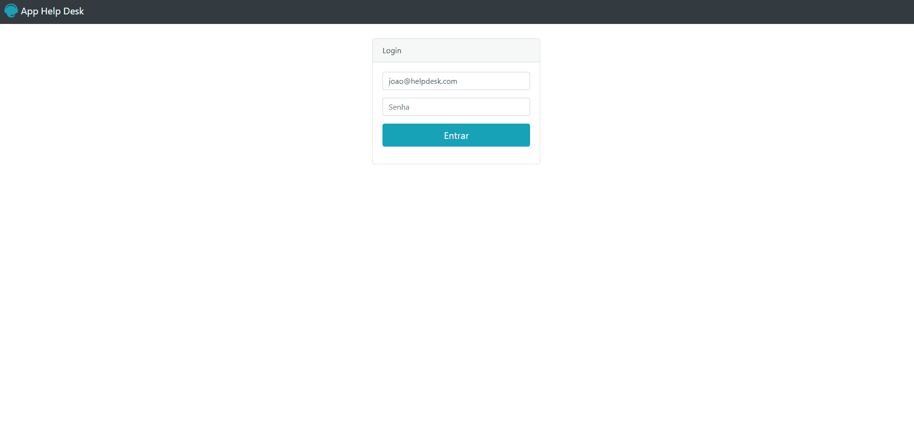

<h2 align="center">
Help Desk App
</h2>

  

<h3 align="center">  
  <a href="#information_source-sobre">Sobre</a> |
  <a href="#interrobang-motivo">Motivo</a> | 
  <a href="#rocket-tecnologias-utilizadas">Tecnologias</a> |  
</h3>

## :information_source: Sobre

Aplicação para criação e visualização de chamados de suporte. Possuindo dois níveis de acesso, onde o usuário padrão apenas cria chamados e visualiza os próprios chamados, e o usuário Administrador que visualiza todos os chamados já feitos.

## :interrobang: Motivo

O motivo do desenvolvimento da aplicação de Help Desk, é treinar e fixar estudos sobre as funçoes nativas do PHP e recursos da superglobal $_SESSION para criação de sessões e sistemas de login onde hierarquias de acesso são necessárias.

## :rocket: Tecnologias Utilizadas

O projeto foi desenvolvido utilizando as seguintes tecnologias

- HTML
- CSS (framework Bootstrap)
- PHP